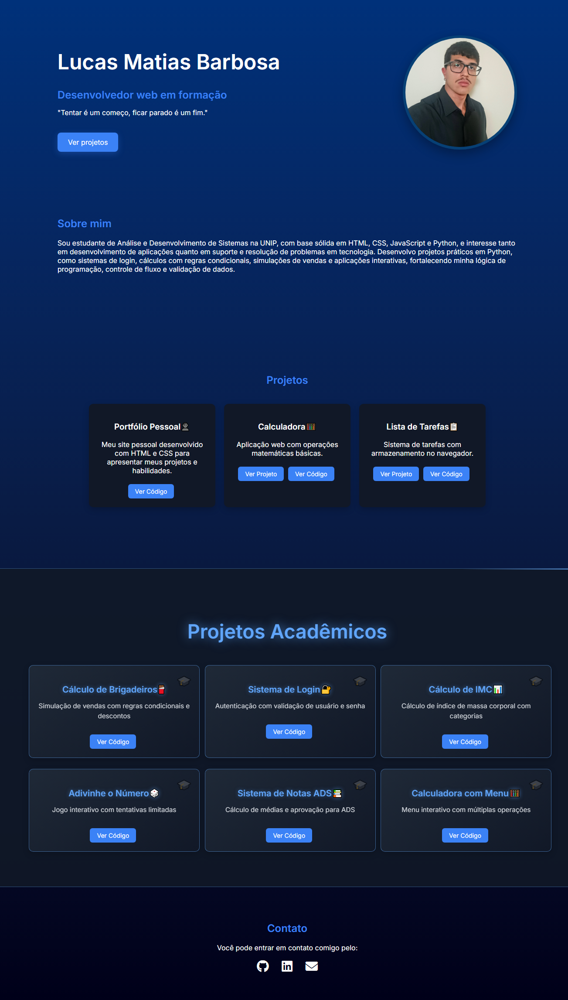

# Portfólio Pessoal

Este é o meu portfólio pessoal desenvolvido com:

* HTML
* CSS

## Funcionalidades

* Seção inicial com apresentação
* Seção "Sobre mim"
* Seção de projetos
* Seção de contato com links para GitHub, LinkedIn e Email
* Layout moderno com tema escuro

## Objetivo

Projeto criado para apresentar minhas habilidades, projetos e evolução como desenvolvedor, além de servir como portfólio profissional para oportunidades de estágio em Desenvolvimento Frontend.

## Como usar

Abra o arquivo:

index.html

no navegador.

ou acesse a versão online pelo GitHub Pages.

## Autor

Lucas Matias Barbosa

[GitHub](https://github.com/lucasmb0202-droid)
[LinkedIn](https://linkedin.com/in/lucasmatiasbarbosa)